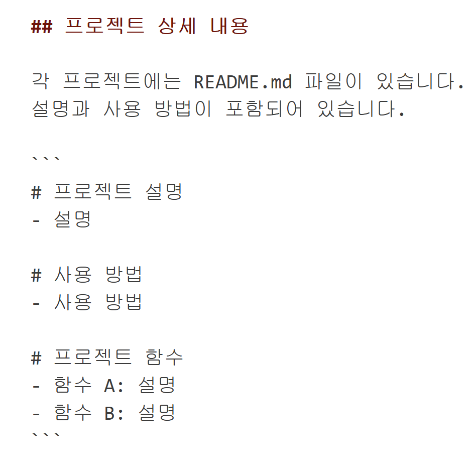

# mcpsecurity
mcp로 보안 취약점 점검을 하는 대기고등학교 프로젝트

## 프로젝트 설명

MCP를 통한 보안 취약점 점검을 위한 프로젝트입니다. 이 프로젝트는 대기고등학교 학생들이 보안 취약점 점검을 할 수 있도록 만든 프로젝트입니다.

## 프로젝트 상세 내용

각 프로젝트에는 README.md 파일이 있습니다. 이 파일에는 프로젝트에 대한 자세한 설명과 사용 방법이 포함되어 있습니다.

```
# 프로젝트 설명
- 설명

# 사용 방법
- 사용 방법

# 프로젝트 함수
- 함수 A: 설명
- 함수 B: 설명
```

## 프로젝트 실행 화면

### 오재혁


### 유호윤


### 이준호
